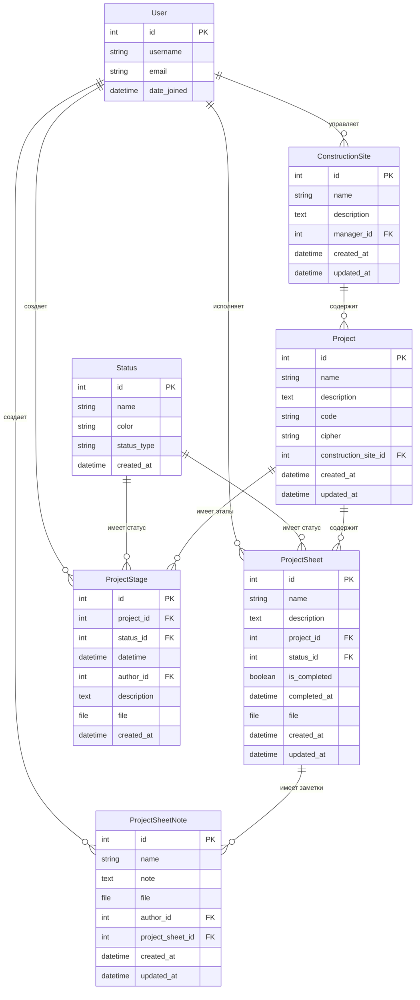

# Блок-схема моделей проекта

## Диаграмма связей моделей

## Описание моделей

### User (Пользователь)
- Стандартная модель Django
- Связи: управляет участками, исполняет листы, создает этапы и заметки

### Status (Статус)
- Типы: `sheet` (проектный лист), `stage` (этап проекта)
- Используется для отслеживания состояния листов и этапов

### ConstructionSite (Строительный участок)
- Содержит проекты
- Имеет менеджера (User)
- Вычисляемый процент выполнения (средний по проектам)

### Project (Проект)
- Принадлежит строительному участку
- Имеет код и шифр
- Вычисляемый процент выполнения (по завершенным листам)

### ProjectSheet (Проектный лист)
- Принадлежит проекту
- Имеет статус, исполнителей (ManyToMany с User)
- Может быть помечен как выполненный
- Автоматически устанавливает дату выполнения

### ProjectStage (Этап проекта)
- Принадлежит проекту
- Имеет дату-время и автора
- Может содержать файлы и описание

### ProjectSheetNote (Заметка проектного листа)
- Принадлежит проектному листу
- Имеет автора
- Может содержать файлы

